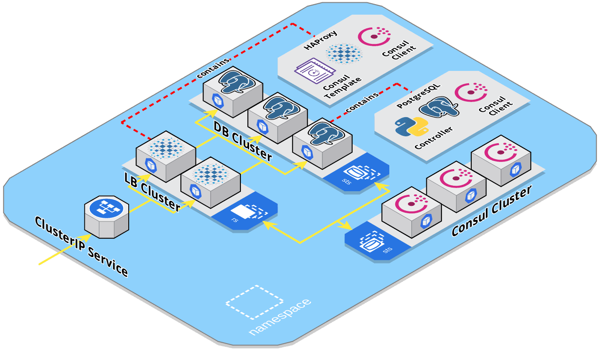

# HA PostgreSQL on Kubernetes

[](https://travis-ci.org/bishoybassem/k8s-ha-postgres)

This project serves as a proof of concept for a highly available PostgreSQL setup using Consul, HAProxy, and Kubernetes. Helm is used to package and install the solution to K8s. Moreover, a [Travis CI](https://travis-ci.org/bishoybassem/k8s-ha-postgres) build is set up, which installs minikube, builds the docker images, deploys the chart, and finally runs integration tests simulating different failure scenarios. 

## Features

The setup features the following:
* A db cluster with two pods at least (StatefulSet), one acting as master and the rest as standbys (streaming replication).
* Which db pod gets to be master is based on leader election implemented using Consul. ([guide](https://learn.hashicorp.com/consul/developer-configuration/elections))
* Automatic failover in case the master db's health checks fail.
* A ClusterIP service to be used by clients, backed by a lb cluster with two pods at least (ReplicaSet).
* A lb port that forwards traffic to the current master, and is to be used for writing/replication by clients/standbys. 
* Another lb port that distributes traffic among the healthy standbys, and is to be used for read-only queries.

## Implementation



A database pod consists of the following containers:
* __postgres__: the PostgreSQL database process.
* __consul__: a Consul agent running in client mode. 
* __controller__: a multithreaded process written in Python that monitors the local __postgres__ db, participates in leader election, and maintains/exposes the state of the pod. 

On the other hand, a loadbalancer pod runs the following containers:
* __haproxy__: listens for client connections, and proxies them to the appropriate db pods.
* __consul__: the Consul agent running in client mode. 
* __consul-template__: watches the state in Consul for db cluster changes, and configures the local __haproxy__ accordingly.

Within the db pod, the __controller__ has the following responsibilities:
* Executes the health checks, `postgresAlive` and `postgresStandbyReplication`, for the local db and updates Consuls' checks accordingly. In case the master db pod fails the alive check, Consul would then release the leadership lock, allowing any healthy standby db pod to take over the master/leader role.
* Monitors the election status and constantly tries to acquire the leadership lock. If acquired, it promotes the standby db to master by executing `pg_promote()`. 
* Exposes the health status via an HTTP endpoint `/controller/ready`, which is used as a readiness probe by K8s, and as a health check by the lb.
* Exposes the role via HTTP endpoint `/controller/role`, that is queried by the db container during startup, and would answer with one of the following:
  * `Master`, which causes the db to start as a normal master, and execute init scripts if needed.    
  * `Replica`, which causes the db to create a base backup of the current master (to be used as the starting point for streaming replication), and start in standby mode. 
  * `DeadMaster`, which causes the db container to block during startup/restarts.

The __haproxy__ within the lb pod listens on the following ports:
* `*:5432`, which directs traffic to the master backend.
* `*:5433`, which balances connections among pods within the standby backend (leastconn algorithm).
* `127.0.0.1:9998`, which exposes the Runtime API for configuring HAProxy (admin level).
* `*:9999`, which exposes the same api, however, for querying statistics only (user level). 

The __haproxy__ backends are configured by __consul-template__. It monitors the election key `service/postgres/master`, and updates the master backend in case the key's content changes (through the Runtime API). It also queries Consul for healthy `postgres` services, and updates the standby backend accordingly (excluding the current master from the list).

Additionally, __haproxy__ monitors the health of the db pods (exposed by their __controller__) to determine whether to keep connections open or not. This is needed in order to force clients/slaves to retry connecting to the new master in case of a failover, or to another standby in case the one they were using experiences issues.

Finally, deleting a dead master db pod, would spawn a new one whose init container __wait-pgdata-empty__ would block if the db's PersistentVolume contains data. This way, the cluster's admin would get a chance to clean up the PV, signal the init container to proceed, and then the db pod would start as a standby with a clean filesystem. 

## Requirements

To test the setup locally, the following needs to be present/installed:
* Docker (used version 19.03.5-ce).
* Minikube (used version 1.6.2, with `none` driver).
* Kubernetes (used version 1.17.0).
* Helm (used version 3.0.2).

## Steps

1. Clone the repository, and navigate to the clone directory.
2. Run the chart deployment script, which builds the docker images, installs the helm chart, and waits for the cluster to be ready:
   ```bash
   ./scripts/deploy-chart.sh
   ```
3. Monitor the cluster state by running the following:
   ```bash
   watch -t kubectl get pods
   ```
   The watch command will keep refreshing the pods' info, and the output should look like this:
   ```bash
   NAME                READY   STATUS    RESTARTS   AGE
   consul-0            1/1     Running   0          2m23s
   consul-1            1/1     Running   0          2m12s
   consul-2            1/1     Running   0          2m7s
   ha-postgres-0       3/3     Running   0          2m23s
   ha-postgres-1       3/3     Running   0          78s
   ha-postgres-2       3/3     Running   0          42s
   postgres-lb-cpj57   3/3     Running   0          2m23s
   postgres-lb-zjjql   3/3     Running   0          2m23s
   ```
4. In another terminal, run the demo script, which would get the master's ClusterIP service, create a test table, and start inserting records using `psql`:
   ```bash
   ./scripts/demo.sh
   ```
   The script also outputs some useful stats and keeps refreshing them:
   ```bash
   Stats (LB/DB stats are refreshed every 10 insert attempts!)

     Client inserts: 247 attempts, 0 failed

     POD           | BACKEND | ENABLED | RECORDS | IN RECOVERY
     ha-postgres-0 | master  | t       | 240     | f
     ha-postgres-1 | standby | t       | 240     | t
     ha-postgres-2 | standby | t       | 240     | t
   ```
5. In a third terminal, overload the master db's cpu as follows:
   ```bash
   kubectl exec -it ha-postgres-0 -c postgres bash
   apt-get update
   apt-get install -y stress
   stress --cpu 1000 -t 20s
   ```
   Notice that the client inserts started to fail, and shortly, one of the standbys would be promoted to master, while the other would start replicating from it:
   ```bash
   Stats (LB/DB stats are refreshed every 10 insert attempts!)

     Client inserts: 384 attempts, 37 failed

     POD           | BACKEND | ENABLED | RECORDS | IN RECOVERY
     ha-postgres-0 | -       | -       | 282     | f
     ha-postgres-1 | master  | t       | 343     | f
     ha-postgres-2 | standby | t       | 343     | t
   ```
6. Now that the old master is down, the cluster admin needs to delete the pod, and cleanup its PV as follows:
   ```bash
   kubectl delete pod ha-postgres-0
   # Wait for the replacement pod to be created
   kubectl exec -it ha-postgres-0 -c wait-pgdata-empty sh
   rm -rf /pgdata/*
   touch /proceed
   ```
   The pod would then start as a standby, and catch up with the replication: 
   ```bash
   Stats (LB/DB stats are refreshed every 10 insert attempts!)

     Client inserts: 734 attempts, 37 failed

     POD           | BACKEND | ENABLED | RECORDS | IN RECOVERY
     ha-postgres-0 | standby | t       | 693     | t
     ha-postgres-1 | master  | t       | 693     | f
     ha-postgres-2 | standby | t       | 693     | t
   ```