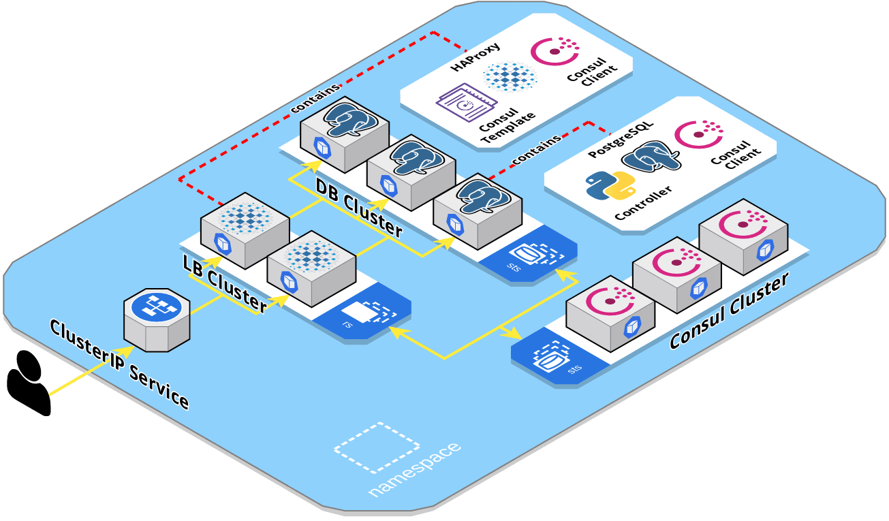

# HA PostgreSQL on Kubernetes

[](https://travis-ci.org/bishoybassem/k8s-ha-postgres)

This project serves as a proof of concept for a highly available PostgreSQL setup using Consul, HAProxy, and Kubernetes. Helm is used to package and install the solution to K8s. Moreover, a [Travis CI](https://travis-ci.org/bishoybassem/k8s-ha-postgres) build is set up, which installs minikube, builds the docker images, deploys the chart, and finally runs integration tests simulating different failure scenarios. 

## Table of Contents
1. [Features](#features)
2. [Implementation](#implementation)
3. [Demo](#demo)
4. [Migration & Upgrades](#migration--upgrades)
5. [Configuration](#configuration)

## Features

The setup features the following:
* A db cluster with two pods at least (StatefulSet), one acting as master and the rest as standbys (streaming replication).
* Which db pod gets to be master is based on leader election implemented using Consul. ([guide](https://learn.hashicorp.com/consul/developer-configuration/elections))
* Automatic failover in case the master db's health checks fail.
* A ClusterIP service to be used by clients, backed by a lb cluster with two pods at least (ReplicaSet).
* A lb port that forwards traffic to the current master, and is to be used for writing/replication by clients/standbys. 
* Another lb port that distributes traffic among the healthy standbys, and is to be used for read-only queries.
* Zero downtime migration/upgrades through logical replication.

## Implementation



A database pod consists of the following containers:
* __postgres__: the PostgreSQL database process.
* __consul__: a Consul agent running in client mode. 
* __controller__: a multithreaded process written in Python that monitors the local __postgres__ db, participates in leader election, and maintains/exposes the state of the pod. 

On the other hand, a loadbalancer pod runs the following containers:
* __haproxy__: listens for client connections, and proxies them to the appropriate db pods.
* __consul__: the Consul agent running in client mode. 
* __consul-template__: watches the state in Consul for db cluster changes, and configures the local __haproxy__ accordingly.

Within the db pod, the __controller__ has the following responsibilities:
* Executes the health checks, `postgresAlive` and `postgresStandbyReplication`, for the local db and updates Consuls' checks accordingly. In case the master db pod fails the alive check, Consul would then release the leadership lock, allowing any healthy standby db pod to take over the master/leader role.
* Monitors the election status and constantly tries to acquire the leadership lock. If acquired, it promotes the standby db to master by executing `pg_promote()`. 
* Exposes the health status via an HTTP endpoint `/controller/ready`, which is used as a readiness probe by K8s, and as a health check by the lb.
* Exposes the role via HTTP endpoint `/controller/role`, that is queried by the db container during startup, and would answer with one of the following:
  * `Master`, which causes the db to start as a normal master, and execute init scripts if needed.    
  * `Replica`, which causes the db to create a base backup of the current master (to be used as the starting point for streaming replication), and start in standby mode. 
  * `DeadMaster`, which causes the db container to block during startup/restarts.

The __haproxy__ within the lb pod listens on the following ports:
* `*:5432`, which directs traffic to the master backend.
* `*:5433`, which balances connections among pods within the standby backend (leastconn algorithm).
* `127.0.0.1:9998`, which exposes the Runtime API/stats socket for configuring HAProxy (admin level).
* `*:9999`, which exposes a user level stats socket, and allows querying statistics only. 

The __haproxy__ backends are configured by __consul-template__. It monitors the election key `service/postgres/master`, and updates the master backend in case the key's content changes (through the Runtime API). It also queries Consul for healthy `postgres` services, and updates the standby backend accordingly (excluding the current master from the list).

Additionally, __haproxy__ monitors the health of the db pods (exposed by their __controller__) to determine whether to keep connections open or not. This is needed in order to force clients/slaves to retry connecting to the new master in case of a failover, or to another standby in case the one they were using experiences issues.

Finally, deleting a dead master db pod, would spawn a new one whose init container __clean-data__ would block if the db's PersistentVolume contains data. This way, the cluster's admin would get a chance to clean up the PV, signal the init container to proceed, and then the db pod would start as a standby with a clean filesystem.

## Demo

To test the setup locally, the following needs to be present/installed:
* Docker (used version 19.03.8-ce).
* Minikube (used version 1.9.2, with `none` driver).
* Kubernetes (used version 1.18.1).
* Helm (used version 3.1.2).

After installing the requirements listed above, do the following:
1. Clone the repository, and navigate to the clone directory.
2. Run the chart deployment script with the namespace to use:
   ```bash
   ./scripts/deploy-chart.sh demo-ns
   ```
   This script would build the docker images, create the namespace (recreate if it exists), install the helm chart there, and wait for the cluster to be ready. At the end, it would output the pods in the namespace:
   ```bash
   NAME                READY   STATUS    RESTARTS   AGE
   consul-0            1/1     Running   0          114s
   consul-1            1/1     Running   0          106s
   consul-2            1/1     Running   0          101s
   ha-postgres-0       3/3     Running   0          114s
   ha-postgres-1       3/3     Running   0          58s
   ha-postgres-2       3/3     Running   0          34s
   postgres-lb-gbqb8   3/3     Running   0          114s
   postgres-lb-rpcvf   3/3     Running   0          114s
   ```
3. Start the demo script with the created namespace:
   ```bash
   ./scripts/demo.sh demo-ns
   ```
   This script would create a test table in the db, and keep inserting records (using the lb's ClusterIP service). It would also monitor the state of the cluster, output several stats, and keep refreshing them:
   ```bash
   Stats (LB/DB stats are refreshed every 10 insert attempts!)

     Client inserts: 247 attempts, 0 failed

     POD           | BACKEND | ENABLED | RECORDS | IN RECOVERY
     ha-postgres-0 | master  | t       | 240     | f
     ha-postgres-1 | standby | t       | 240     | t
     ha-postgres-2 | standby | t       | 240     | t
   ```
4. In another terminal, overload the master db's cpu as follows:
   ```bash
   kubectl -n demo-ns exec -it ha-postgres-0 -c postgres -- bash
   apt-get update
   apt-get install -y stress
   stress --cpu 1000 -t 20s
   ```
   Notice that the client inserts started to fail, and shortly, one of the standbys would be promoted to master, while the other would start replicating from it:
   ```bash
   Stats (LB/DB stats are refreshed every 10 insert attempts!)

     Client inserts: 384 attempts, 37 failed

     POD           | BACKEND | ENABLED | RECORDS | IN RECOVERY
     ha-postgres-0 | -       | -       | 282     | f
     ha-postgres-1 | master  | t       | 343     | f
     ha-postgres-2 | standby | t       | 343     | t
   ```
5. Now that the old master is down, the cluster admin needs to delete the pod, and cleanup its PV as follows:
   ```bash
   kubectl -n demo-ns delete pod ha-postgres-0
   # Wait for the replacement pod to be created
   kubectl -n demo-ns exec -it ha-postgres-0 -c clean-data -- sh
   rm -rf /pgdata/*
   touch /proceed
   ```
   The pod would then start as a standby, and catch up with the replication: 
   ```bash
   Stats (LB/DB stats are refreshed every 10 insert attempts!)

     Client inserts: 734 attempts, 37 failed

     POD           | BACKEND | ENABLED | RECORDS | IN RECOVERY
     ha-postgres-0 | standby | t       | 693     | t
     ha-postgres-1 | master  | t       | 693     | f
     ha-postgres-2 | standby | t       | 693     | t
   ```

## Migration & Upgrades
The initial migration to this chart, or in-place upgrades to PostgreSQL, would incur some downtime due to the following reasons:
* Clients won't be able to execute write queries during a master db restart. 
* PostgreSQL db files are incompatible with newer major versions.
* Since applications tend to pool db connections, properly draining those connections before restarting the db would be challenging. 

To overcome the above issues, and with zero downtime, the following steps should be taken:
1. Create a new db cluster with the new version/changes.
2. Configure the new db cluster to logically replicate from the existing one (referred to as "seed db").
3. Wait for the replication to catch up.
4. Perform an application failover, i.e., set them to use the new db cluster.
5. Destroy the seed db cluster.

This chart allows configuring a seed db through the `db.seedDb.*` parameters (refer to the [configuration section](#configuration) below). Setting the `db.seedDb.host` would cause the master to create a subscription during initialization with the configured values.

## Configuration
The following table lists the configurable parameters of the chart and their default values:

| Parameter                                               |  Description `Default`                                                                                          | 
|---------------------------------------------------------|-----------------------------------------------------------------------------------------------------------------| 
| `db.clusterSize`                                        |  Db StatefulSet replicas `3`                                                                                    | 
| `db.seedDb.host`                                        |  Db host to seed/logically replicate from `nil`                                                                 | 
| `db.seedDb.port`                                        |  Seed db port `nil`                                                                                             | 
| `db.seedDb.name`                                        |  Seed db name `nil`                                                                                             | 
| `db.seedDb.user`                                        |  Seed db user `nil`                                                                                             | 
| `db.seedDb.password`                                    |  Seed db password `nil`                                                                                         | 
| `db.seedDb.publication`                                 |  Seed db publication name `nil`                                                                                 | 
| `db.postgres.image`                                     |  Postgres container image <br/>`ha-postgres:12.2`                                                               | 
| `db.postgres.name`                                      |  Postgres db name `postgres`                                                                                    | 
| `db.postgres.users.su.name`                             |  Postgres super user's name `postgres`                                                                          | 
| `db.postgres.users.su.password`                         |  Postgres super user's password `su123`                                                                         | 
| `db.postgres.users.replication.password`                |  Postgres replication user's password `rep123`                                                                  | 
| `db.postgres.settings`                                  |  Postgres additional system settings <br/>`{"wal_keep_segments": 10}`                                           | 
| `db.postgres.resources`                                 |  Postgres container resources <br/>`{"limits": {"cpu": "500m", "memory": "512Mi"}}`                             | 
| `db.postgres.storage.className`                         |  Postgres data PV storage class `nil`                                                                           | 
| `db.postgres.storage.size`                              |  Postgres data PV size `1Gi`                                                                                    | 
| `db.controller.image`                                   |  Controller container image <br/>`ha-postgres-controller:1.0.0`                                                 | 
| `db.controller.checkInterval`                           |  Controller time interval (in seconds) between two consecutive health/leader election checks `10`               | 
| `db.controller.connectTimeout`                          |  Controller timeout (in seconds) for connecting to postgres during health checks `1`                            | 
| `db.controller.aliveCheckFailureThreshold`              |  Controller number of consecutive failures for the alive health check to be considered failed `1`               | 
| `db.controller.standbyReplicationCheckFailureThreshold` |  Controller number of consecutive failures for the standby replication health check to be considered failed `4` | 
| `db.controller.consulKeyPrefix`                         |  Controller Consul key path prefix to use for the election key or for storing state `ha-postgres`               | 
| `db.controller.resources`                               |  Controller container resources <br/>`{"limits": {"cpu": "250m", "memory": "64Mi"}}`                            | 
| `db.cleanData.image`                                    |  CleanData container image <br/>`curlimages/curl:7.69.1`                                                        | 
| `db.cleanData.resources`                                |  CleanData container resources <br/>`{"limits": {"cpu": "100m", "memory": "64Mi"}}`                             | 
| `lb.clusterSize`                                        |  Lb ReplicaSet replicas `2`                                                                                     | 
| `lb.service`                                            |  Lb ClusterIP service name `postgres`                                                                           | 
| `lb.masterDbPort`                                       |  Lb port that forwards traffic to the current master `5432`                                                     | 
| `lb.standbyDbPort`                                      |  Lb port that distributes traffic among the healthy standbys `5433`                                             | 
| `lb.maxNumberOfStandbys`                                |  Maximum number of standbys that the cluster could ever have `10`                                               | 
| `lb.haproxy.image`                                      |  HAProxy container image <br/>`haproxy:2.1.2`                                                                   | 
| `lb.haproxy.timeouts.connect`                           |  HAProxy connection attempt timeout `2s`                                                                        | 
| `lb.haproxy.timeouts.read`                              |  HAProxy maximum inactivity time set on the client & server sides `30m`                                         | 
| `lb.haproxy.statsPort`                                  |  HAProxy user level stats socket TCP port `9999`                                                                | 
| `lb.haproxy.livenessProbe`                              |  HAProxy container liveness probe additional settings <br/>`{"initialDelaySeconds": 10}`                        | 
| `lb.haproxy.readinessProbe`                             |  HAProxy container readiness probe additional settings <br/>`{"failureThreshold": 1}`                           | 
| `lb.haproxy.resources`                                  |  HAProxy container resources <br/>`{"limits": {"cpu": "150m", "memory": "256Mi"}}`                              | 
| `lb.consulTemplate.image`                               |  ConsulTemplate container image <br/>`hashicorp/consul-template:0.24.1-alpine`                                  | 
| `lb.consulTemplate.resources`                           |  ConsulTemplate container resources <br/>`{"limits": {"cpu": "100m", "memory": "64Mi"}}`                        | 
| `consul.image`                                          |  Consul container image <br/>`consul:1.6.2`                                                                     | 
| `consul.server.clusterSize`                             |  Consul server StatefulSet replicas `3`                                                                         | 
| `consul.server.service`                                 |  Consul server headless service name `consul`                                                                   | 
| `consul.server.livenessProbe`                           |  Consul server container liveness probe additional settings <br/>`{"initialDelaySeconds": 60}`                  | 
| `consul.server.resources`                               |  Consul server container resources <br/>`{"limits": {"cpu": "250m", "memory": "128Mi"}}`                        | 
| `consul.server.storage.className`                       |  Consul server data PV storage class `nil`                                                                      | 
| `consul.server.storage.size`                            |  Consul server data PV size `100Mi`                                                                             | 
| `consul.client.resources`                               |  Consul client container resources <br/>`{"limits": {"cpu": "100m", "memory": "64Mi"}}`                         | 

Moreover, placing `.sh`/`.sql` scripts in the chart's folder `files/postgres-init-scripts`, would cause the master to execute them during initialization.